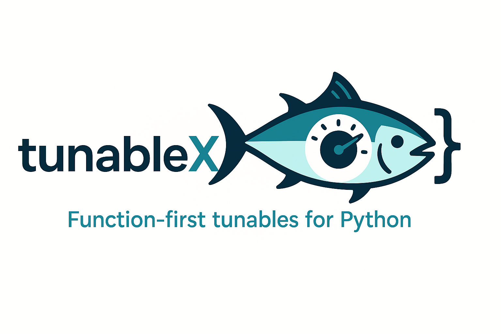

<p align="center">
  
</p>
# tunableX

Function-first **tunable parameters** for Python apps — with:

- **Ergonomic @tunable decorator** (declare per‑function user parameters right where they live).
- **Automatic Pydantic models → JSON & JSON Schema** (rich defaults, validation constraints, literals, Paths, etc.).
- **Two composition strategies**:
  - By **app tags** (`apps=("train", "serve", ...)`) for explicit executable groupings.
  - By **static AST call graph of an entrypoint** (no tags needed) – generate a config from just a function without executing user code.
- **Runtime auto‑injection** (`use_config`) so decorated functions receive values transparently.
- **CLI flag generation** (argparse / jsonargparse) with defaults & help text sourced from Pydantic Field metadata.
- **Deterministic merge order**: defaults ← optional config file ← CLI overrides.

> NOTE: Previous versions used runtime tracing (schema_by_trace, add_flags_by_trace via tracing). This has been replaced by **static AST analysis** for zero‑execution safety and reproducibility. The compatibility alias `add_flags_by_trace` still works but now delegates to static analysis.

---
## Install
```bash
pip install tunablex  # (or your project env)
```

---
## Quick Tour

### 1. Declare tunables
```python
from typing import Literal
from pydantic import Field
from tunablex import tunable

@tunable("hidden_units", "dropout", namespace="model", apps=("train",))
def build_model(hidden_units: int = Field(128, ge=1, description="Hidden units"),
                dropout: float = Field(0.2, ge=0.0, le=1.0, description="Dropout")):
    ...

@tunable("epochs", "batch_size", "optimizer", namespace="train", apps=("train",))
def train(epochs: int = Field(10, ge=1, description="Epochs"),
          batch_size: int = Field(32, ge=1, description="Batch size"),
          optimizer: Literal["adam", "sgd"] = Field("adam", description="Optimizer")):
    ...
```
Nested namespaces are supported (e.g. `namespace="model.preprocess"`).

### 2. Compose a config model (Explicit App Tags)
```python
from tunablex import schema_for_apps, defaults_for_apps, make_app_config_for

schema = schema_for_apps("train")        # JSON Schema dict
defaults = defaults_for_apps("train")    # Default values dict
AppConfig = make_app_config_for("train") # Pydantic model type
```

### 3. Compose a config model (Static Entry Analysis – No Tags)
```python
from tunablex import schema_by_entry_ast, make_app_config_for_entry

# Suppose train_main() calls several @tunable functions (directly or nested)
from mypkg.pipeline import train_main

schema, defaults, namespaces = schema_by_entry_ast(train_main)
AppConfig = make_app_config_for_entry(train_main)
```
The static analyzer parses the entrypoint’s source and gathers directly called function names (simple, safe heuristic) to select matching registered tunable namespaces.

### 4. Use a config at runtime
```python
from tunablex import use_config
cfg = AppConfig(**{...})  # or AppConfig.model_validate(loaded_json)
with use_config(cfg):
    train_main()  # All @tunable calls see their section injected
```

### 5. Generate schema & defaults files (entrypoint)
```python
from tunablex import schema_by_entry_ast, write_schema
schema, defaults, _ = schema_by_entry_ast(train_main)
write_schema("train_config", schema, defaults)  # writes train_config.schema.json + train_config.json
```

---
## CLI Integration

### jsonargparse (App Tags)
```python
from jsonargparse import ArgumentParser
from tunablex import add_flags_by_app, build_cfg_from_file_and_args, use_config
import examples.myapp.pipeline as pipeline

parser = ArgumentParser(prog="train_jsonarg_app")
parser.add_argument("--config", help="Optional config JSON")
AppConfig = add_flags_by_app(parser, app="train")
args = parser.parse_args()
cfg_dict = build_cfg_from_file_and_args(AppConfig, args)
cfg = AppConfig.model_validate(cfg_dict)
with use_config(cfg):
    pipeline.train_main()
```

### jsonargparse (Static Entry Analysis)
```python
from jsonargparse import ArgumentParser
from tunablex import add_flags_by_entry, build_cfg_from_file_and_args, use_config
import examples.myapp.pipeline as pipeline

parser = ArgumentParser(prog="train_jsonarg_trace")  # name preserved for backwards compat
parser.add_argument("--config", help="Optional config JSON")
AppConfig = add_flags_by_entry(parser, pipeline.train_main)  # or add_flags_by_trace(...)
args = parser.parse_args()
cfg_dict = build_cfg_from_file_and_args(AppConfig, args)
cfg = AppConfig.model_validate(cfg_dict)
with use_config(cfg):
    pipeline.train_main()
```
Generated flags look like:
```
--model.hidden_units --model.dropout --model.preprocess.dropna ... --train.epochs --train.batch_size --train.optimizer
```
Boolean flags support `--no-...` negation via `jsonargparse`’s `BooleanOptionalAction`.

### argparse (Entry Analysis)
See `examples/argparse_trace/train_trace.py` for schema generation & loading using static analysis (`schema_by_entry_ast`, `load_config_for_entry`).

---
## Config Merge Order
1. Pydantic defaults (from each `@tunable` Field / default value)
2. JSON file loaded via `--config` (if provided)
3. CLI overrides (flags explicitly present on the command line)

This precedence is verified by the test suite (`tests/test_overrides.py`).

---
## API Reference (Exports)
- Decorator: `tunable`
- Composition (apps): `make_app_config_for`, `schema_for_apps`, `defaults_for_apps`, `load_app_config`
- Composition (entry): `make_app_config_for_entry`, `schema_by_entry_ast`, `load_config_for_entry`
- Schema output: `write_schema`
- Runtime: `use_config`
- CLI helpers: `add_flags_by_app`, `add_flags_by_entry`, `add_flags_by_trace` (alias), `build_cfg_from_file_and_args`

---
## Migration From Tracing
Previous API: `schema_by_trace`, `add_flags_by_trace(entrypoint)` performed runtime execution to discover call chains. These have been superseded by **static AST analysis**:
- Use `schema_by_entry_ast(entrypoint)` instead of `schema_by_trace`.
- Use `add_flags_by_entry` (alias: `add_flags_by_trace`) for CLI flag generation.
Benefits:
- No side‑effects or data loading just to build a config schema.
- Faster repeated schema generation in CI / docs.
- Works in restrictive or sandboxed environments.

---
## Examples Directory
- `examples/myapp/pipeline.py` – shared tunable functions.
- `examples/argparse_app/train_app.py` – classic app‑tag flow.
- `examples/jsonargparse_app/train_jsonarg_app.py` – jsonargparse + tags.
- `examples/argparse_trace/train_trace.py` – entrypoint static analysis with schema generation.
- `examples/jsonargparse_trace/train_jsonarg_trace.py` – jsonargparse + static analysis.
- `examples/trace_generate_schema.py` – write schema + defaults to disk (AST based).

Run tests:
```bash
pytest -q
```

---
## Philosophy
Keep tunable definition *close to the logic*; avoid giant central configs. Let the decorator accumulate structure automatically while remaining explicit and type‑checked. Provide zero‑execution schema generation so packaging, documentation, and deployment pipelines stay safe and reproducible.

---
## License
MIT
